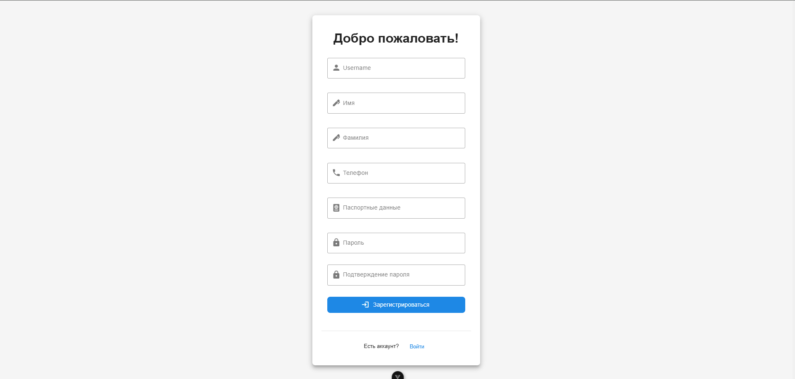
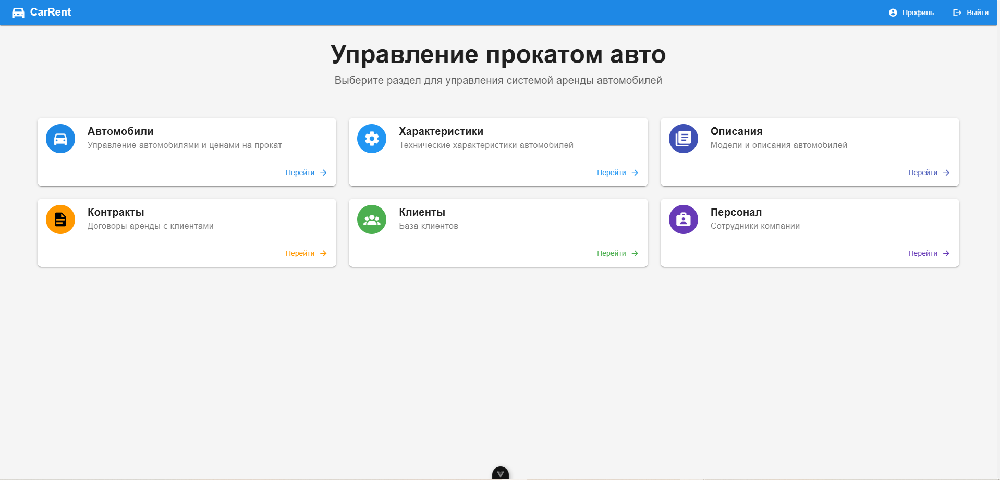
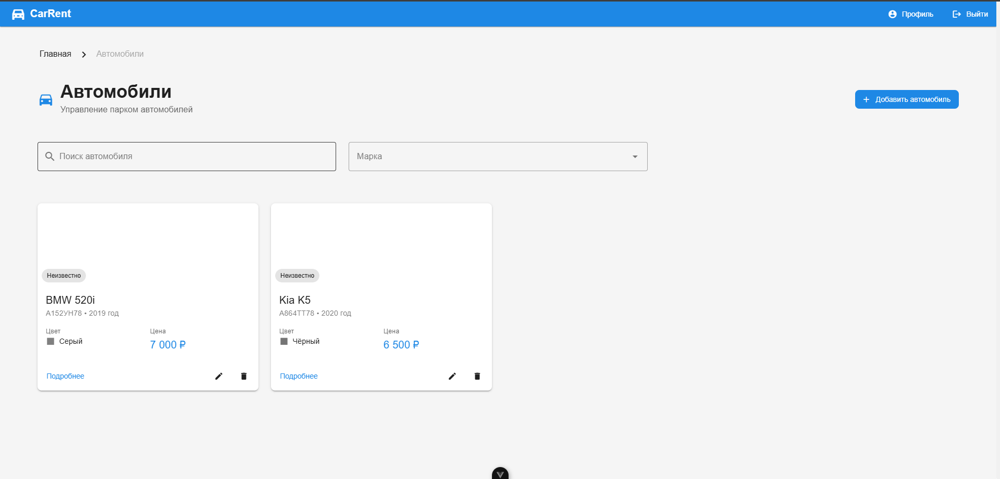
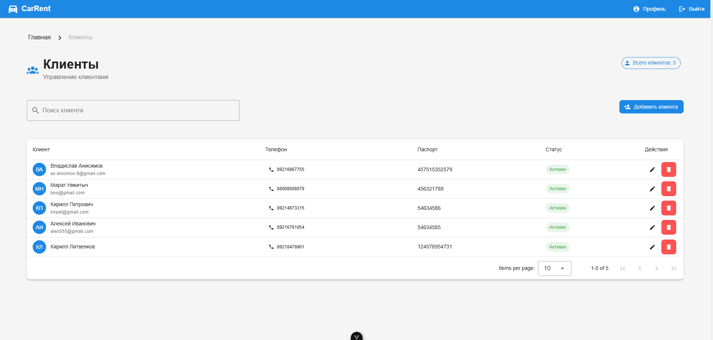
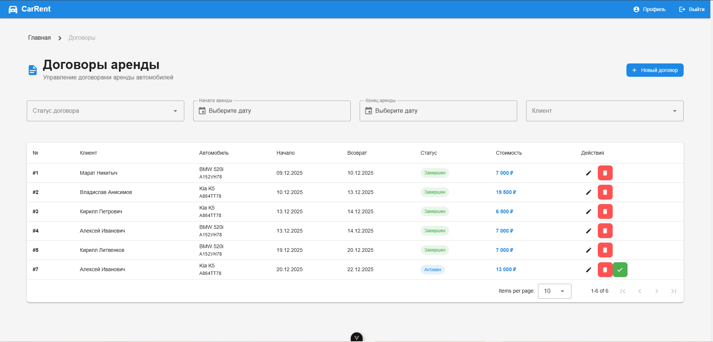

# Лабораторная работа 4

В рамках данной лабораторной работы была создана админ-панель, которая взаимодействует с API (в том числе и с Djoser для аутентификации) написаным в предыдущей лабораторной работе и позволяет управлять системой по аренде авто.

## Разработанные интерфейсы

### Регистрация
Взаимодействует с djoser для создания нового аккаунта и получения токена.   

### Вход
Взаимодействует с djoser для получения токена.

### Профиль
Взаимодействует с djoser для получения данных о текущем пользователя по токену. Также есть базовая возможность смены пароля пользователя.

### Главная страница
Даёт возможность перехода на все остальные интерфейсы.   

### Автомобили

Загружает данные об 
автомобилях и поддерживает CRUD операции.   

### Характеристики

Загружает данные о 
характеристиках автомобилей и поддерживает CRUD операции (с валидацией).   

### Описания авто

Отображает данные об 
описаниях автомобилей и поддерживает CRUD операции.   

### Персонал

Показывает весь персонал компании. Позволяет добавлять сотрудников из существующих аккаунтов.   

### Клиенты
Позволяет управлять клиентами, в том числе и регистрировать новых (взаимодействуя с djoser).   

### Контракты
Интерфейс для управления контрактами (их создание и закрытие).   

